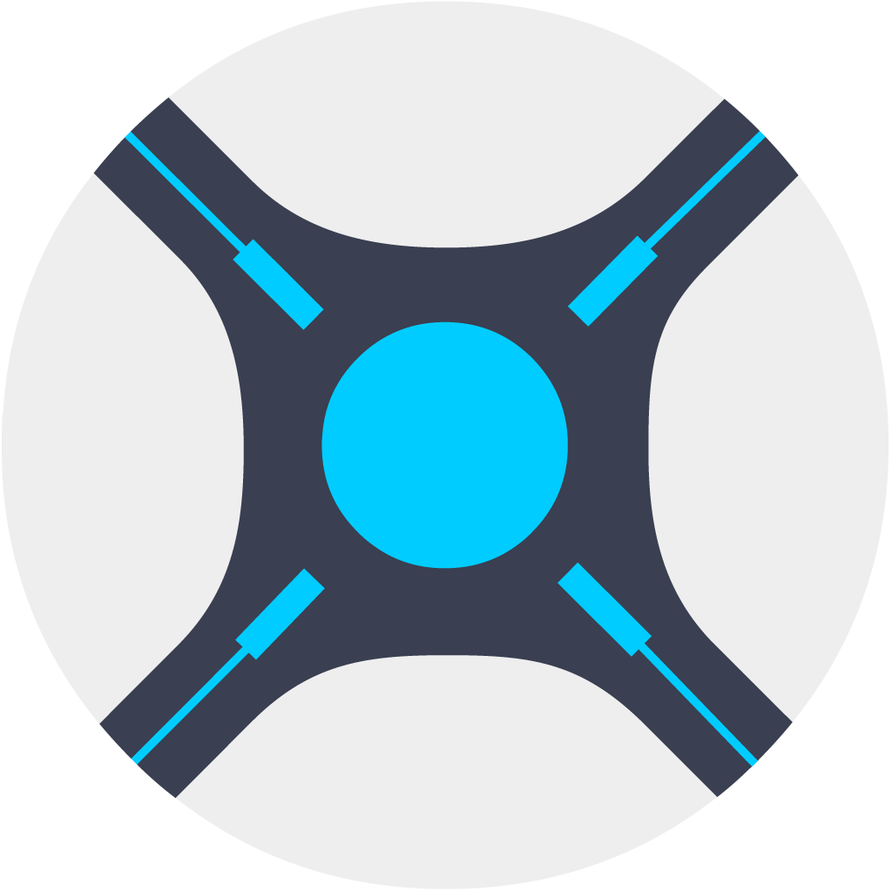

<center align="center" style="text-align: center;justify-content:center;">
<div align="center" style="text-align: center;justify-content:center;">
<h1 align="center" style="text-align: center;justify-content:center;">

Sonarr MCP server




</h1>


   

</div>
</center>

<hr>

Run Sonarr from Claude.ai and Claude Code. All 234 operations of the v3 API are tools, generated from Sonarr's own OpenAPI document. Not a curated subset: every endpoint Sonarr's web interface can reach, this can reach.

<hr>

## Why not the other options

Measured against `Sonarr.Api.V3/openapi.json`, which has 162 paths and 234 non-HEAD operations:

| Server | Sonarr tools | Coverage |
| --- | --- | --- |
| `davidgibbons/mcp-arr` | 17 | 7 % |
| `niavasha/plex-mcp-server` | 8 | 3 % |
| `bardesss/arr-mcp` | unified verbs across 10 services | partial |
| This one | **234** | **100 %** |

The others hand-write a tool per endpoint they happened to need, so they cover series, queue and calendar and stop there. Nothing else exposes `customformat`, `releaseprofile`, `delayprofile`, `autotagging`, `importlistexclusion`, `manualimport`, `seasonpass`, `remotepathmapping` or `qualitydefinition` at all.

## How it stays complete

`src/sonarr_mcp/tools.py` is generated, not written:

```bash
curl -o openapi.json https://raw.githubusercontent.com/Sonarr/Sonarr/develop/src/Sonarr.Api.V3/openapi.json
python scripts/generate_tools.py openapi.json src/sonarr_mcp/tools.py
```

A test compares every generated call against every operation in the spec, in both directions. An endpoint Sonarr adds and this misses fails the build; so does a tool pointing at an endpoint the spec does not define.

## Tool names

Verb first, derived from the method and path, so the name says what it does:

| Pattern | Meaning | Example |
| --- | --- | --- |
| `list_*` | Read a collection | `list_series`, `list_queue` |
| `get_*_by_id` | Read one record | `get_series_by_id` |
| `create_*` | POST | `create_series`, `create_command` |
| `update_*` | PUT | `update_qualityprofile_by_id` |
| `delete_*` | DELETE | `delete_episodefile_by_id` |

234 tools is a lot to put in front of a model at once. If your client supports tool filtering, narrow it to the groups you use.

## What is covered

All 69 resource groups: `series`, `episode`, `episodefile`, `seasonpass`, `queue`, `history`, `blocklist`, `calendar`, `wanted`, `command`, `release`, `manualimport`, `rename`, `parse`, `indexer`, `indexerflag`, `downloadclient`, `importlist`, `importlistexclusion`, `qualityprofile`, `qualitydefinition`, `customformat`, `customfilter`, `releaseprofile`, `delayprofile`, `autotagging`, `notification`, `metadata`, `tag`, `rootfolder`, `remotepathmapping`, `language`, `localization`, `mediacover`, `filesystem`, `diskspace`, `health`, `log`, `update`, `backup`, `system` and the config endpoints.

## Setup

```bash
git clone https://github.com/rollecode/sonarr-mcp.git
cd sonarr-mcp
uv venv && uv pip install -e .
```

```bash
export SONARR_URL=http://127.0.0.1:8989
export SONARR_API_KEY=...   # Settings, General, Security
```

### Claude Code

```bash
claude mcp add sonarr -- /path/to/sonarr-mcp/.venv/bin/sonarr-mcp
```

## Writing records

Sonarr replaces a record on PUT rather than merging, so read it first, change the fields you want and send the whole object back as `body`. For a new resource, `list_*_schema` returns the shape it expects.

## Development

```bash
uv pip install -e . pytest ruff
.venv/bin/python -m pytest tests
.venv/bin/ruff check .
```

